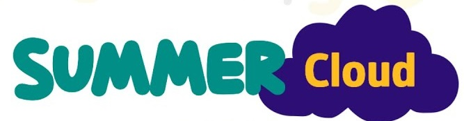

<h1>CloudSurfers</h1>

# Guía de estudio 
Guía de estudio de Azure Fundamentals AZ900, innovAccion Virtual

  Podrás acceder fácilmente a todos los módulos de estudio y a links a enlaces muy interesantes que te ayudarán a entender mejor los temas y conceptos.
  Y no solo eso, sino entender el funcionamiento del uso de servicios en la nube para poder implementarlo. 

#Contenido

## Módulo 1: Descripción de los conceptos básicos de Azure
 
Aqui encontraras los conceptos básicos que te ayudaran a entender el funcionamiento de diferentes servicios de Azure, es de donde parte tu competencia hacia la meta. Siendo este módulo uno de los de mayor peso en la certificación
##
- [Introducción a los aspectos básicos de Azure
](https://docs.microsoft.com/es-es/learn/modules/intro-to-azure-fundamentals/)
- [Conceptos fundamentales de Azure
](https://docs.microsoft.com/es-mx/learn/modules/fundamental-azure-concepts/)
- [Descripción de los componentes principales de la arquitectura de Azure
](https://docs.microsoft.com/es-mx/learn/modules/azure-architecture-fundamentals/)

### Práctica!
Aquí podrás visitar los ejercicios prácticos corresnpondientes al módulo 1

### Repaso express módulo 1
En está sección encontraras el contenido del módulo dividido y sintetizado en mapas
- [Aspectos básicos de Azure](https://docs.microsoft.com/es-es/learn/modules/intro-to-azure-fundamentals/)
- [Ventajas la nube pública](https://docs.microsoft.com/es-es/learn/modules/intro-to-azure-fundamentals/)

## Módulo 2: Descripción de los servicios básicos de Azure
Aprende sobre los servicios básicos que aporta Azure al mundo, como Azure compute, Azure Storage, Azure Database y Network, de aquí parten los demás recursos que se verán en los siguientes módulos
##
- [Exploración de los servicios de Azure Compute
](https://docs.microsoft.com/es-mx/learn/modules/azure-compute-fundamentals/)
- [Exploración de los servicios de red de Azure
](https://docs.microsoft.com/es-mx/learn/modules/azure-networking-fundamentals/)
- [Exploración de los servicios de Azure Storage
](https://docs.microsoft.com/es-mx/learn/modules/azure-storage-fundamentals/)
- [Exploración de los servicios de análisis y bases de datos de Azure
](https://docs.microsoft.com/es-mx/learn/modules/azure-database-fundamentals/)

### Práctica!
- 
### Repaso Express módulo 2
- 

## Módulo 3: Descripción de las principales soluciones y herramientas de administración de Azure
Entramos a los servicios más complejos y exploramos diferentes escenarios que nos ayudaran a decidir que servicio elegir dependiendo de las características descritas en cada caso

##
- [Elegir el mejor servicio de Azure IoT para su aplicación
](https://docs.microsoft.com/es-mx/learn/modules/iot-fundamentals/)
- [Elija el mejor servicio de IA para sus necesidades
](https://docs.microsoft.com/es-mx/learn/modules/ai-machine-learning-fundamentals/)
- [Elección de la mejor tecnología sin servidor de Azure para su escenario empresarial
](https://docs.microsoft.com/es-mx/learn/modules/serverless-fundamentals/)
- [Elección de las mejores herramientas para ayudar a que las organizaciones creen mejores soluciones
](https://docs.microsoft.com/es-mx/learn/modules/azure-devops-devtest-labs/)
- [Elección de las mejores herramientas para administrar y configurar el entorno de Azure
](https://docs.microsoft.com/es-mx/learn/modules/management-fundamentals/)
- [Elección del mejor servicio de supervisión para visibilidad, información y mitigación de interrupciones
](https://docs.microsoft.com/es-mx/learn/modules/monitoring-fundamentals/)

### Práctica!
- 
### Repaso Express módulo 3
- 
## Módulo 4: Descripción de las caracteristicas de seguridad general y seguridad de red
Aprende de seguridad en la nube y ve que te aporta Azure en está área

##
- [Protección frente a amenazas de seguridad en Azure
](https://docs.microsoft.com/es-mx/learn/modules/protect-against-security-threats-azure/)
- [Conectividad de red segura en Azure
](https://docs.microsoft.com/es-mx/learn/modules/secure-network-connectivity-azure/)

### Práctica!
- 
### Repaso Express módulo 4

## Módulo 5: Descripción de las características de identidad, gobernanza, privacidad y cumplimiento

Entender quién usa tus sistemas y qué permisos tiene es imprescindible para proteger tus datos de los atacantes. Para poder organizarse, administrar costos y alcanzar los objetivos de cumplimiento, es necesario disponer de una buena estrategia de gobernanza en la nube.
Obten información sobre cómo Azure puede ayudarle a proteger el acceso a los recursos de la nube, qué significa crear una estrategia de gobernanza en la nube y cómo Azure cumple con los estándares habituales normativos y de cumplimiento.

##
- [Acceso seguro a las aplicaciones con servicios de identidad de Azure
](https://docs.microsoft.com/es-mx/learn/modules/secure-access-azure-identity-services/)
- [Creación de una estrategia de gobernanza en la nube en Azure
](https://docs.microsoft.com/es-mx/learn/modules/build-cloud-governance-strategy-azure/)
- [Examine los estándares de privacidad, cumplimiento y protección de datos en Azure
](https://docs.microsoft.com/es-mx/learn/modules/examine-privacy-compliance-data-protection-standards/)
### Práctica!
-
### Repaso express módulo 5
-

## Módulo 6: Descripción de los acuerdos de nivel de servicio y la administración de costos de Azure
Conoce sobre los factores que influyen en el costo, las herramientas que se pueden usar para poder estimar y administrar el gasto en la nube, y sobre cómo los acuerdos de nivel de servicio de Azure (SLA) pueden influir en las decisiones de diseño de una aplicación.
### Módulos de Microsoft Learn (Challenge)
- [Planeación y administración de los costos de Azure
](https://docs.microsoft.com/es-mx/learn/modules/plan-manage-azure-costs/)
- [Elección de los servicios de Azure adecuados según los acuerdos de nivel de servicio y el ciclo de vida del servicio
](https://docs.microsoft.com/es-mx/learn/modules/choose-azure-services-sla-lifecycle/)
### Práctica!
-
### Repaso express módulo 5

#### La cosa no es como se usa la herramienta, sino cómo ella nos usa. 
-Nick Joaquin

